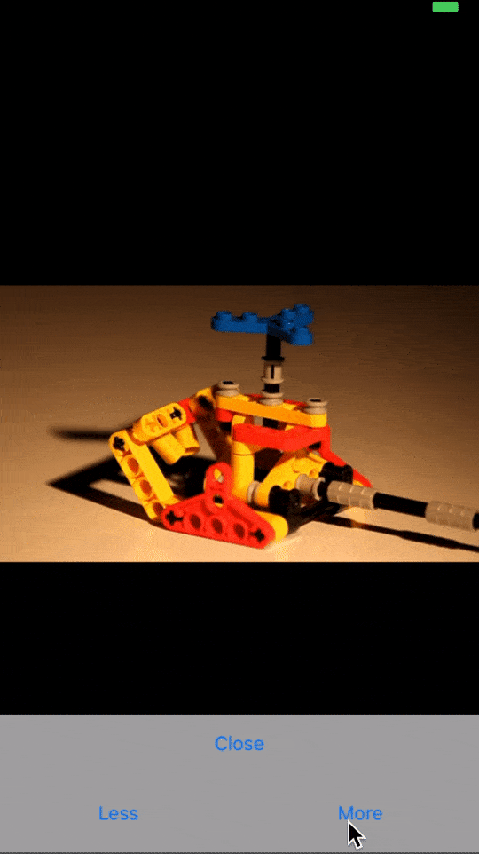

# ATEVolumeView


## What you will see ...



## Installation

ATEVolumeView is available through my private repository at github so, if you want to install in this way you must include this into your Podfile

```ruby
source 'https://github.com/daviwiki/daviwiki-podspecs'
```

Once included you could import the Pod into your desired spec.

```ruby
pod 'ATEVolumeView'
```

## Example

To run the example project, clone the repo, and run `pod install` from the Example directory first.

## Installation and Usage of the code example include

Once you have installed the Pod (or cloning the code o whatever you need :) ... **how could i use this tool?**. Lets see this point by point:

At the time we are writting this documentation two differents volume items are available:

- ATERectangleVolumeView
- ATENotchVolumeView (iPhone with notch only)

Let's assume we want to add the *ATERectangleVolumeView* to our UI (ATENotchVolumeView is added in very similar way)

All we need to do is implement the following method in our UIView / UIViewController.

```swift
private func mountVolumeControl(into view: UIView) {
    let configuration = ATEVolumeRectangleConfiguration(backgroundColor: .gray,
                                                        foregroundColor: .purple,
                                                        timeDisplayedAfterVolumeChange: 2)
    let volumeView = ATEVolumeRectangleViewBuilder()
        .set(configuration: configuration)
        .set(parentView: view)
        .build()

    volumeView.bind(inside: view)
}
```
and called it passing it the view where we want to added the volume view.

**Note:**
If you want to configure your own autolayouts for the volume view you mustn't pass a parentView to the builder. Your code look like this:

```swift
private func mountVolumeControl(into view: UIView) {
    let configuration = ATEVolumeRectangleConfiguration(backgroundColor: .gray,
                                                        foregroundColor: .purple,
                                                        timeDisplayedAfterVolumeChange: 2)
    let volumeView = ATEVolumeRectangleViewBuilder()
        .set(configuration: configuration)
        //  .set(parentView: view)  <-- Remove this one
        .build()

    // And now add this ones:
    view.addSubview(volumeView as! UIView)

    // Configure your anchors **right here**

    volumeView.bind(inside: view)
}
```

## Author

daviwiki, daviddv19@gmail.com

## License

ATEVolumeView is available under the MIT license. See the LICENSE file for more info.
